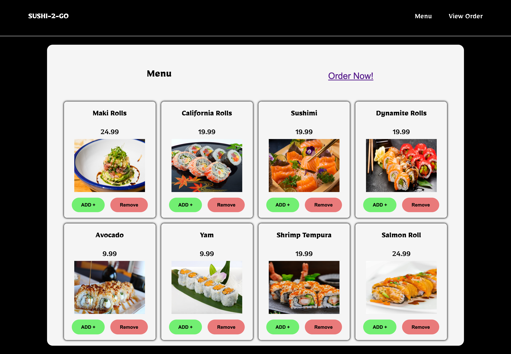
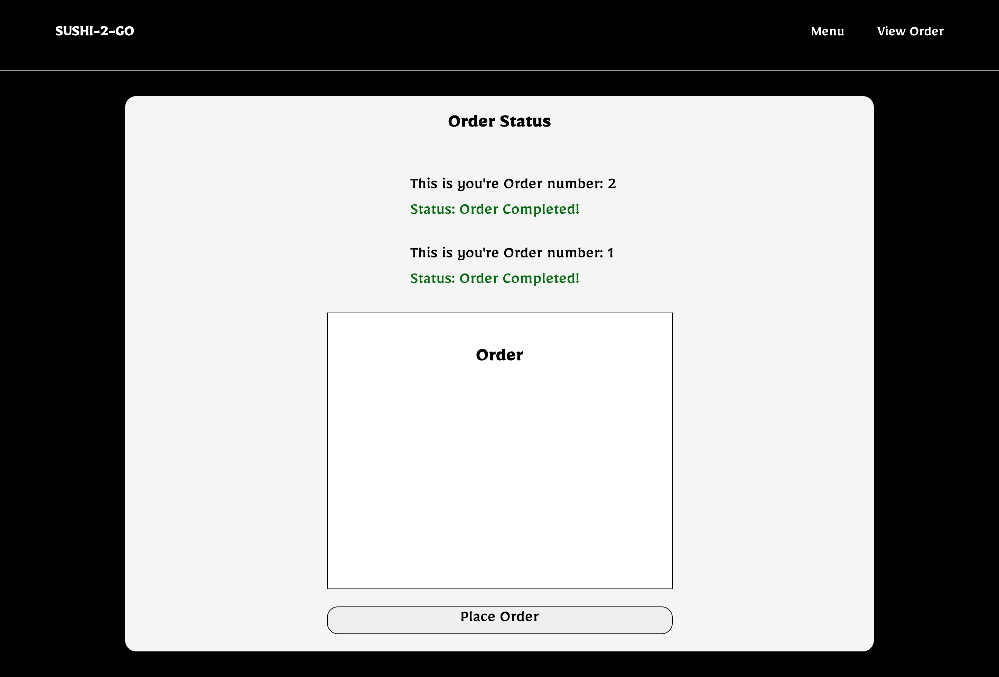
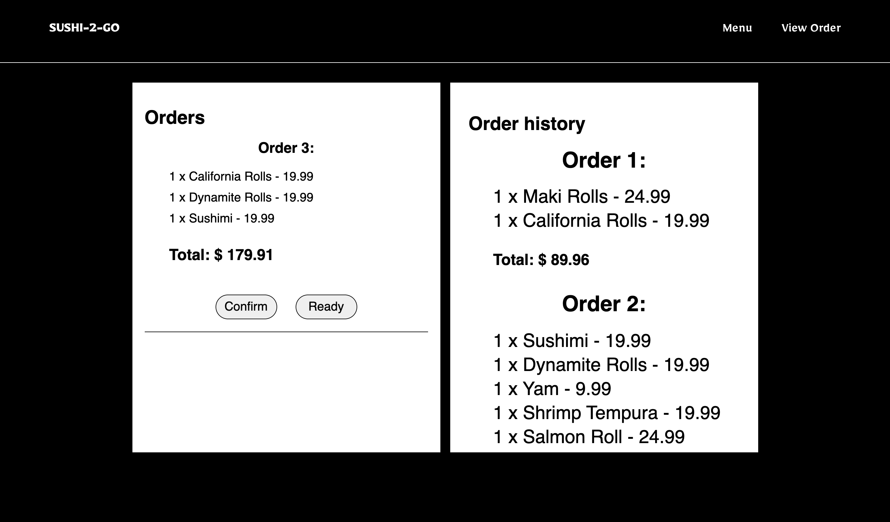

# Sushi 2 Go - Restaurant Ordering Application

Sushi 2 Go is a restaurant ordering application that allows users to browse a menu, add items to their cart, and place an order. The application supports both user and restaurant sides for a seamless ordering process.

## Features

- User Side:

  - Browse the menu and select items to add to the order cart.
  - Submit the order and receive an SMS with the order details.
  - Receive updates on the order status, including confirmation and food readiness.

- Restaurant Side:
  - Receive and confirm incoming orders from users.
  - Notify users when their order is confirmed and ready for pickup.

## Technologies Used

- EJS
- NodeJs
- jQuery
- Twillo
- Scss

## Screenshots

_Screenshot of the menu page._

_Screenshot of the order page._

_Screenshot of the restaurant side._

## Created by:

- [GitHub - Mfried95](https://github.com/Mfried95)
- [GitHub - rida-batool](https://github.com/rida-batool)
- [GitHub - yusufurur](https://github.com/yusufurur)

## Installation

Follow these steps to get the project up and running:

git clone https://github.com/Mfried95/grab-your-sushi-now

- npm install
- npm run db:reset
- npm start
